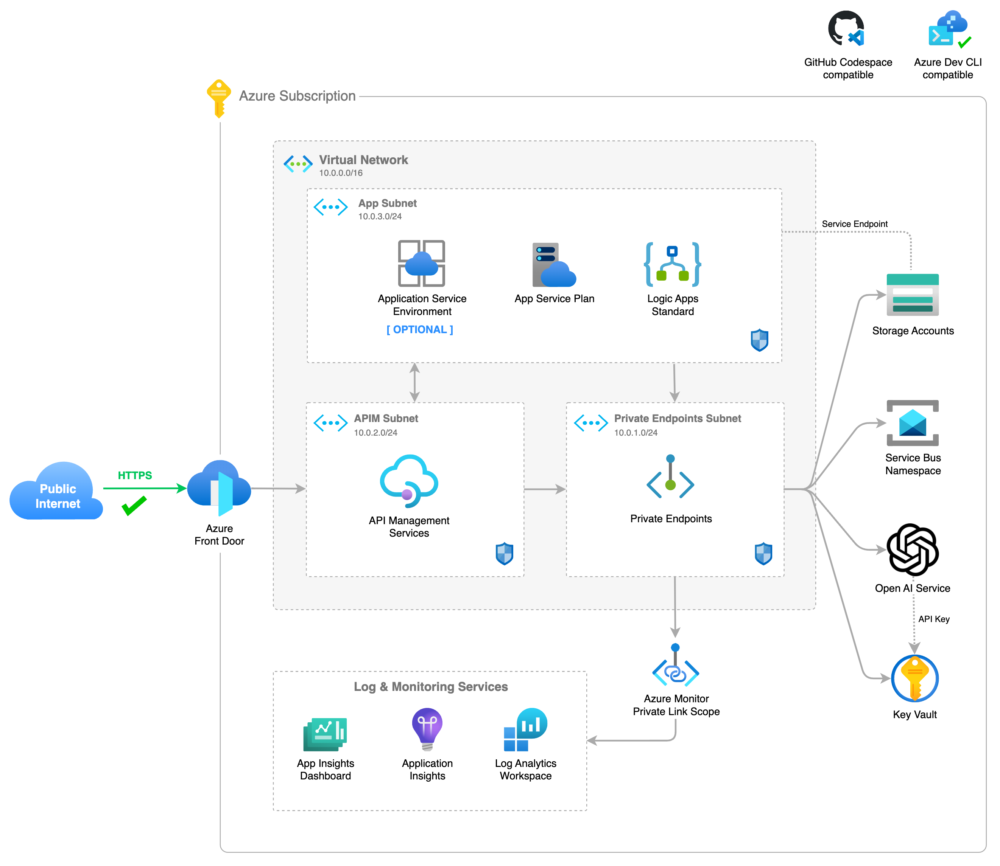

# Azure Integration Services Accelerator (AISA)

[](https://codespaces.new/ffilardi-insight/azure-integration-services-accelerator)
[](https://vscode.dev/redirect?url=vscode://ms-vscode-remote.remote-containers/cloneInVolume?url=https://codespaces.new/ffilardi-insight/azure-integration-services-accelerator)

## About

This repository is based on Azure Developer CLI bicep templates available at AZD Template Library [here](https://azure.github.io/awesome-azd). More information about `azd` [here](https://learn.microsoft.com/en-us/azure/developer/azure-developer-cli/). The resources follows the architecture best practices as described in the [Azure Integration Service Landingzone Accelerator](https://github.com/Azure/Integration-Services-Landing-Zone-Accelerator/tree/main) and the [Azure OpenAI Landing Zone reference architecture](https://techcommunity.microsoft.com/t5/azure-architecture-blog/azure-openai-landing-zone-reference-architecture/ba-p/3882102). 

The following assets are included:

- Infrastructure-as-code (IaC) bicep template files under the `infra` folder to provision and setup resources.
- A [dev container](https://containers.dev) configuration file under the `.devcontainer` directory that installs infrastructure tooling by default. This can be readily used to create cloud-hosted developer environments such as [GitHub Codespaces](https://aka.ms/codespaces), or locally/on-premises environments using Docker.
- Continuous deployment workflows for CI providers such as GitHub Actions under the `.github` directory, and Azure Pipelines under the `.azdo` directory that work for most use-cases.

## Architecture



## Infrastructure Resources

Resources are deployed into multiple resources groups by default. They are classified into major 4 groups: `network`, `monitor`, `shared` and `integration`. The list of resources in each of these groups are listed below. 

###  Networking & Connectivity Services

| Resource | Type | File Location |
|----------|--------|----------|
| Virtual Network and Subnets | Network | `/infra/modules/network/vnet.bicep` |
| Network Security Groups | Network | `/infra/modules/network/nsg.bicep` |
| Private DNS Zones | Connectivity | `/infra/modules/network/private-dns.bicep` |
| Private Endpoint Config | Connectivity | `/infra/modules/network/private-endpoint-config.bicep` |
| Private Endpoint | Connectivity | `/infra/modules/network/private-endpoint.bicep` |
| Azure Monitor Private Link Scope | Connectivity | `/infra/modules/network/private-link-scope.bicep` |
| Public IP Address | Connectivity | `/infra/modules/network/public-ip.bicep` |

### Logs & Monitoring Services

| Resource | Type | File Location |
|----------|--------|----------|
| App Insights | Monitoring | `/infra/modules/monitor/applicatinoinsights.bicep` |
| App Insights Dashboard | Monitoring | `/infra/modules/monitor/applicatinoinsights-dashboard.bicep` |
| Log Analytics Workspace | Logs | `/infra/modules/monitor/loganalytics.bicep` |

### Shared Services

| Resource | Type | File Location |
|----------|--------|----------|
| Key Vault | Security | `/infra/modules/keyvault/keyvault.bicep` |
| Key Vault Role Assignment | Security | `/infra/modules/keyvault/role-assignment.bicep` |
| Key Vault Secret | Security | `/infra/modules/keyvault/secret.bicep` |
| Storage Account | Storage | `/infra/modules/storage/storage.bicep` |
| Storage Blob | Storage | `/infra/modules/storage/blob.bicep` |
| Storage File | Storage | `/infra/modules/storage/file.bicep` |
| Storage Queue | Storage | `/infra/modules/storage/queue.bicep` |
| Storage Table | Storage | `/infra/modules/storage/table.bicep` |

### Apps & Integration Services

| Resource | Type | File Location |
|----------|--------|----------|
| API Management | API | `/infra/modules/apim/apim.bicep` |
| OpenAI API Endpoints | API | `/infra/modules/apim/openai-api.bicep` |
| OpenAI API Specification | API | `/infra/modules/apim/api/openai-api-specification.json` |
| OpenAI API Policy | API | `/infra/modules/apim/policy/openai-api-policy.xml` |
| OpenAI API Operation Policy | API | `/infra/modules/apim/policy/openai-api-operation-policy.xml` |
| Front Door | CDN | `/infra/modules/frontdoor/cdn.bicep` |
| Front Door APIM Setup | CDN | `/infra/modules/frontdoor/apim-setup.bicep` |
| Front Door APIM Endpoints | CDN | `/infra/modules/frontdoor/apim-endpoints.bicep` |
| Front Door APIM WAF Policies | CDN | `/infra/modules/frontdoor/apim-waf-policies.bicep` |
| Service Bus Namespace | Messaging | `/infra/modules/servicebus/servicebus.bicep` |
| Service Bus Queues | Messaging | `/infra/modules/servicebus/queues.bicep` |
| Service Bus Topics | Messaging | `/infra/modules/servicebus/topics.bicep` |
| Azure Open AI | Cognitive Services | `/infra/modules/ai/cognitiveservices.bicep` |
| App Service Environment | Hosting | `/infra/modules/ase/ase.bicep` |
| App Service Environment DNS Config | Hosting | `/infra/modules/ase/ase-dns-config.bicep` |
| App Service Plan | Hosting | `/infra/modules/apps/service-plan.bicep` |
| Logic Apps Standard | Application | `/infra/modules/apps/workflow.bicep` |

## Naming convention

The pattern specified below is used to define resource names, including resource group, when the values are not provided in the parameters file.

    {resource_abbreviation}-{environment_name}-{token}

The ***resource abbreviation*** is pre-defined in the configuration file `abbreviations.json` in the root folder.  The ***token*** value is an unique string created from a combination of the subscription id, environment name and location selected.

## Prerequisites

#### Running locally:

- Azure Developer CLI
- Azure Bicep
- Azure CLI or Azure PowerShell
- Docker (for running local Dev Containers)
- Git
- Visual Studio Code

#### Running on cloud:

- GittHub account (for running on GitHub Codespace)

## Next Steps

### Step 1: Initialize a new `azd` environment

```shell
azd init
```

It will prompt you to provide a name that will later be used in the name of the deployed resources.

### Step 2: Provision and deploy all the resources

```shell
azd up
```

It will prompt you to login, pick a subscription, and provide a location (like "eastus"). Then it will provision the resources in your account and deploy the latest code.

For more details on the deployed services, see [additional details](#additional-details) below.

> Note. Because Azure OpenAI isn't available yet in all regions, you might get an error when you deploy the resources. You can find more information about the availability of Azure OpenAI [here](https://docs.microsoft.com/en-us/azure/openai/overview/regions).

> Note. It will take about 45 minutes to deploy Azure API Management.

> Note. Sometimes the dns zones for the private endpoints aren't created correctly / in time. If you get an error when you deploy the resources, you can try to deploy the resources again.

## CI/CD pipeline

This project includes a Github workflow and a Azure DevOps Pipeline for deploying the resources to Azure on every push to main. That workflow requires several Azure-related authentication secrets to be stored as Github action secrets. To set that up, run:

```shell
azd pipeline config
```

## Monitoring

The deployed resources include a Log Analytics workspace with an Application Insights dashboard to measure metrics like server response time.

To open that dashboard, run this command once you've deployed:

```shell
azd monitor --overview
```

## Removing all resources

To remove all resources and resource group, including purging soft-deleted services such as Cognitive Services, Key Vault and API Management, just run the following command:  

```shell
azd down --purge
```

#### API Management soft-delete Script

If you deleted the deployment via the Azure Portal, and you want to run this deployment again, you might run into the issue that the APIM name is still reserved because of the soft-delete feature. You can remove the soft-delete by using this script:

```ps1
$subscriptionId = "<your-subscription-id>"
$locaion = "<resource-region>"
$apimName = "<your-apim-name>"
Connect-AzAccount
Set-AzContext -Subscription $subscriptionId
.\del-soft-delete-apim.ps1 -subscriptionId $subscriptionId -location $location -apimName $apimName
```
